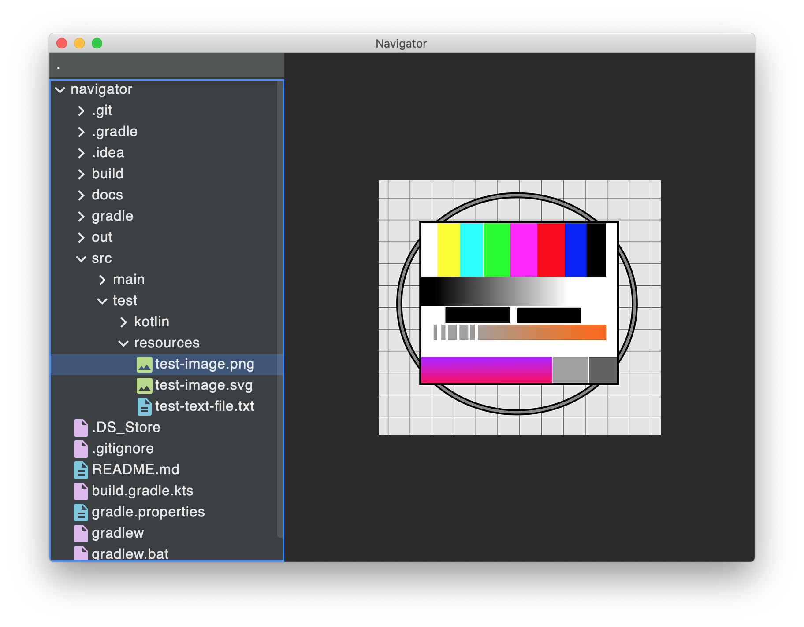

# navigator

A file system navigator, written as a test assignment for JetBrains

## Implementation Progress

### Features

- [x] Tree view of the file system
- [x] Preview panel on the side
- [x] Extensible tree, with capabilities to display other formats than just the file system as nodes - e.g. zip files
- [ ] Keyboard Navigation & Accessibility
    - [x] Arrow keys navigate the directory tree
    - [x] Escape removes the selection
    - [ ] Tab switches between the input field and the directory tree
    - [ ] Keeping the selected row in the view by scrolling if necessary
    - [ ] Optimizing the usability with a screen-reader
- [ ] TBD: Icons?

### Quality

- [ ] Polished and consistent UI with carefully designed:
    - [x] Spacing
    - [x] Animations
    - [ ] Typography
    - [x] Colors
- [x] Performance:
  ~~How many nodes can it display before stuttering? Virtualization? Lazy loading? I'll start without any of that and
  see how far that will get me~~
    - [x] Lazily reading directory/archive content for visible nodes only
    - [x] File I/O moved into `Dispatchers.IO` with coroutines
    - [x] Virtualized scrolling (`LazyColumn`) - A dedicated tree view model allows me to keep the loaded information
      independently of the render result while at the same time using a flattened list of the visible nodes for emitting
      the items in a `LazyColumn`. This enables opening of huge directories like my `C:\Windows\System32` one without
      dropping any frames.
      > The `LazyColumn` [seems to keep me from using animations](https://stackoverflow.com/a/67452325/4887966) for
      > expanding and collapsing nodes. I decided to prioritize responsiveness over animations here and went for the
      > `LazyColumn` without animations.
    - [ ] Scrolling performance analysis - Scrolling still lags a bit in large directories despite the `LazyColumn` -
      will investigate this if I still find the time
- [x] Test Coverage
    - [x] Navigator component (most are deactivated due to missing test API implementations)
    - [x] DirectoryTree component
    - [x] DirectoryTreeItem component
    - [x] Preview component (flaky, see [#4](https://github.com/manu-unter/navigator/issues/4))
    - [x] Node
    - [x] ViewNode
    - [x] Modifier.sequentiallyDoubleClickable (don't work, see [#3](https://github.com/manu-unter/navigator/issues/3))
## Extending the Functionality

The navigator is designed to be easily extensible with new file formats in two ways:

- Making archive files expandable in the tree view, including preview support for the archive content
- Supporting previews for more file types

### Making New Archive File Formats Expandable

To make a new archive file format, e.g. `*.zip` files, expandable, you need to
extend [Node.kt](src/main/kotlin/model/Node.kt) in the following ways:

#### 1. Teach the `Node(file)` factory to treat the archive files differently - e.g. `"application/zip" -> ZipArchive(file)`

The public `Node(file)` factory function instantiates the appropriate `Node` implementations based on information about
the file. Add a new case to the `when` statement which matches for your file type and map the input file to a new `Node`
class, for example `ZipArchive`, which we will implement now.

> The current logic for detecting file content types is very basic. For less mainstream file formats, you might need to
> improve that or replace it with something more advanced like https://tika.apache.org/

#### 2. Add the new `Node` implementation for the archive file itself - e.g. `ZipArchive`

This class will be the transition between the file-system-based part of the tree and the new archive part. It needs to
implement both `Node` and `Expandable`. You can extend the existing `FileSystemFile` class and add your
archive-format-specific logic in the new `listChildren()` method. This is where you read the archive file and parse its
content. Make sure to only process the top-level content of your archive. Map these archive files and directories to
new `Node` classes, for example `ZipArchiveFile` and `ZipArchiveDirectory`, which we will implement next.

#### 3. Add new `Node` implementations for the archive content - e.g. `ZipArchiveFile` and `ZipArchiveDirectory`

Create the two new classes that implement the `Node` interface:

- One class which represents the _files_ inside the archive. It only needs to implement the `Node` interface by
  providing a `label`. You can copy the `FileSystemFile` class as a blueprint - *but make sure to base yours on whatever
  abstraction your archive code uses instead of `File`!*
- One class which represents _directories_ inside the archive. Apart from the `Node` interface, this class also needs to
  implement the `Expandable` interface. It should return its own child `Node`s from `listChildren()` by recursively
  instantiating itself or the file class from above. *Make sure to not call the public `Node()` factory in here but to
  directly instantiate your own new classes instead!*

#### (Optional) 4. Enable file previews for files inside the archive

This is optional functionality which requires that you can do two things for each file _inside_ the archive that you
want to enable previews for:

- Determine the file's MIME-type, e.g. `text/plain`, `image/png`
- Set up an `InputStream` that enables access to the file content

The navigator will automatically show previews for all nodes that implement the `ContentReadable` interface and which
have a supported `contentType`. Currently, it supports most MIME-Types that start with `image/*` and `text/*`.

To enable file previews for your new archive format, you should extend your archive file class with
the `ContentReadable` interface and add the required methods.

### Adding previews for new file types

To display previews for new file types, you need to do two things inside [Preview.kt](src/main/kotlin/Preview.kt):

1. Extend the `when` clause in the `Preview` component - e.g. `"video" -> VideoPreview(node)`
2. Implement the new preview component which shows the file content (e.g. the `VideoPreview` component itself) - you can
   use the existing `ImagePreview` and `TextPreview` components as an inspiration.
